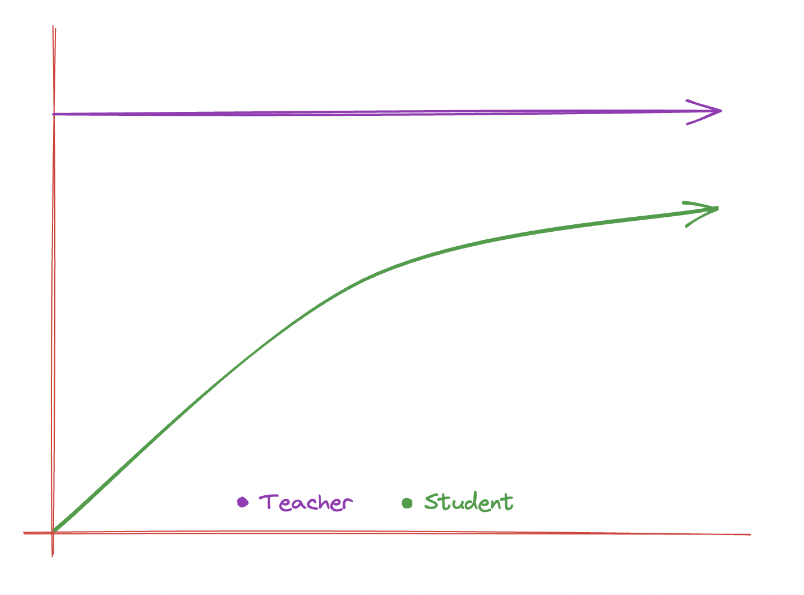

I can't pass any day without watching some YouTube videos related to tech or being a developer. That's how I try to be a better developer: learn, practice, repeat.

But it's not always easy. It's not easy to find good teachers, who sacrifice and learn something new to teach us. I say that because not everyone trying to teach you is like that. There are tons of YouTube channels that are just another copy that teaches the same thing: a very basic introduction to technology. Is that bad? No. I don't have any problem with seeing a topic multiple times, it even may give you a different perspective. What I have a problem with is that there is no progress on the content.

It doesn't get better, and what is so annoying to me is to see the lame "99% of developers doing this wrong!". Who's that 99%? How is that measured? I know we're in the short content era and maybe "they don't have any choice but create clickbait", but that's what I mean by not having any progress.

You can't create 50 different videos about all the aspects of a technology like React and call all of those mistakes that developers make. It can't be true. What they're trying to do? Re-packaging a syllabus as mistakes to avoid.

# What's wrong here?

I think every educational channel can have two ways of creating content. Let me explain using a very simple chart:

I don't think it's possible for a teacher to move all his knowledge to his students. So there will be always a gap between the levels. This doesn't mean that the students can't pass the teacher, but it can't be from that teacher's channel. As you can see if the teacher doesn't learn, the students will be trapped in a level if they only count on that teacher. The progress would be fast at first because the student does not know all the things but with time, it'll get slower and at some point, it probably will stop because there is nothing new on the foundation level you could learn from that teacher.

Now let's see another scenario. What if the teacher also learns new things every day? What will happen then?

You can see that because the teacher is also learning new things, the students learn those and make more progress. There'll be a gap there as always, but both can get higher. Won't you agree?

# Technologies vs. Techniques

In my last post, I talked about trying every new technology you find (you can read it [here](/blog/try-everything-absolutely-everything) if you haven't yet). When I'm talking about trying new technologies and you find a YouTube video that tries to convince you here's the complete guide to Astro in 20 minutes, the result is the same. An "updated" channel with 20 minutes on each technology means you're not swimming into the ocean. It's just a wet street on a rainy day and that's it. You heard about something new and that's good but you also have been left out in the dark to figure it out yourself because the teacher was lazy to actually teach you anything. What about tomorrow? He'll be on a new technology to represent an updated channel.

What do you need? You need to have a better understanding of new technologies. It's good to start with crash courses but in the end, if being a developer is your job, you need to get deeper in the area you need to be.

# A final advice

It's ok to learn piece by piece. It's okay to learn one technique at a time. But be aware of your progress and evaluate the source you're learning from. There are good teachers that can get you to a better level and always remember that every source may have its limits. So don't stick, move, and again, learn, practice, and repeat.
