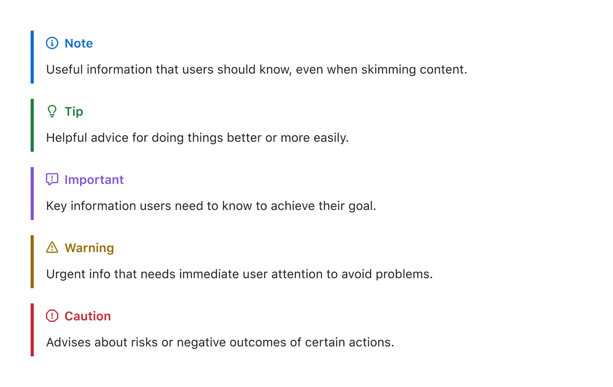

When working with documentation or technical blogs, you might notice special markdown sections labeled as "Note," "Warning," or "Tip." GitHub officially calls these sections "[Alerts](https://docs.github.com/en/get-started/writing-on-github/getting-started-with-writing-and-formatting-on-github/basic-writing-and-formatting-syntax#alerts)", but you might have heard them referred to as "Admonitions" elsewhere.



Alerts are useful for emphasizing key information, pointing out warnings, or providing quick tips to your readers. In this post, I'll guide you through setting up GitHub Alerts in your Astro project and explain how to style them effectively.

## How to Add GitHub Alerts to Astro

Astro makes extending markdown straightforward. Here's how you can quickly set up Alerts in your project:

### Step 1: Install the Required Package

Install the GitHub alerts package in your Astro project:

```shell
npm install remark-github-blockquote-alert
```

This single package handles both the markdown parsing and includes pre-built CSS styling.

### Step 2: Configure Your Astro Project

Open your `astro.config.mjs` file and add the remark plugin:

```js
import { defineConfig } from "astro/config";
import { remarkAlert } from "remark-github-blockquote-alert";

export default defineConfig({
  markdown: {
    remarkPlugins: [remarkAlert],
  },
});
```

### Step 3: Import the CSS Styles

In your blog layout file (where markdown content is rendered), import the included CSS:

```js
import "remark-github-blockquote-alert/alert.css";
```

That's it! Your Astro site now supports GitHub-style alerts with proper styling.

## How it looks in action?

GitHub alerts use a blockquote syntax with special markers. Here are all five types:

```markdown
> [!NOTE]
> GitHub alerts use the blockquote syntax with special markers. This approach is now the standard across GitHub's documentation and is widely supported by static site generators.

> [!TIP]
> Pro tip: You can use alerts to highlight keyboard shortcuts, useful commands, or alternative approaches that might save your readers time. For example, instead of running `npm install`, you could also use `pnpm install` for faster package management.

> [!IMPORTANT]
> When deploying to production, always run your build process first with `npm run build` to catch any TypeScript errors or missing dependencies before your site goes live. This can save you from embarrassing broken deployments.

> [!WARNING]
> Be careful when modifying your `astro.config.mjs` file while the development server is running. Changes to this file require a server restart, and syntax errors here can prevent your entire site from building.

> [!CAUTION]
> Never commit your `.env` files to version control! They often contain API keys and secrets. Always add `.env*` to your `.gitignore` file and use environment variables in your deployment platform instead.
```

**And here how it looks:**

> [!NOTE]
> GitHub alerts use the blockquote syntax with special markers. This approach is now the standard across GitHub's documentation and is widely supported by static site generators.

> [!TIP]
> Pro tip: You can use alerts to highlight keyboard shortcuts, useful commands, or alternative approaches that might save your readers time. For example, instead of running `npm install`, you could also use `pnpm install` for faster package management.

> [!IMPORTANT]
> When deploying to production, always run your build process first with `npm run build` to catch any TypeScript errors or missing dependencies before your site goes live. This can save you from embarrassing broken deployments.

> [!WARNING]
> Be careful when modifying your `astro.config.mjs` file while the development server is running. Changes to this file require a server restart, and syntax errors here can prevent your entire site from building.

> [!CAUTION]
> Never commit your `.env` files to version control! They often contain API keys and secrets. Always add `.env*` to your `.gitignore` file and use environment variables in your deployment platform instead.

## Styling Your Alerts

The `remark-github-blockquote-alert` package includes beautiful default styling that matches GitHub's design. However, you might want to customize the appearance to match your brand or theme.

### Default Styling (Included)

The package comes with:

- **Color-coded backgrounds and borders** for each alert type
- **Appropriate icons** that automatically match the alert context
- **Accessible contrast ratios** and semantic markup

### Customizing with CSS

To override the default styles, target the generated CSS classes in your global stylesheet:

```css
/* Customize NOTE alerts */
.markdown-alert-note {
  background-color: #e3f2fd;
  border-left: 4px solid #2196f3;
  padding: 1rem;
  margin: 1rem 0;
}

/* Customize WARNING alerts */
.markdown-alert-warning {
  background-color: #fff3e0;
  border-left: 4px solid #ff9800;
  padding: 1rem;
  margin: 1rem 0;
}

/* Customize IMPORTANT alerts */
.markdown-alert-important {
  background-color: #f3e5f5;
  border-left: 4px solid #9c27b0;
  padding: 1rem;
  margin: 1rem 0;
}
```

### Customizing with Tailwind CSS

If you're using Tailwind CSS, you can override the styles using the `@apply` directive:

```css
.markdown-alert-note {
  @apply bg-blue-50 border-l-4 border-blue-500 p-4 my-4 rounded-r-lg;
}

.markdown-alert-tip {
  @apply bg-green-50 border-l-4 border-green-500 p-4 my-4 rounded-r-lg;
}

.markdown-alert-warning {
  @apply bg-yellow-50 border-l-4 border-yellow-500 p-4 my-4 rounded-r-lg;
}

.markdown-alert-important {
  @apply bg-purple-50 border-l-4 border-purple-500 p-4 my-4 rounded-r-lg;
}

.markdown-alert-caution {
  @apply bg-red-50 border-l-4 border-red-500 p-4 my-4 rounded-r-lg;
}
```

This approach gives you full control over colors, spacing, and styling while maintaining the alert functionality.

---

GitHub alerts are a game-changer for technical documentation and blog posts. They're already familiar to users, and based on what you need can require zero custom styling work. Since they use GitHub's own syntax, your content will also display correctly if you ever copy it to GitHub repos, discussions, or gists.
